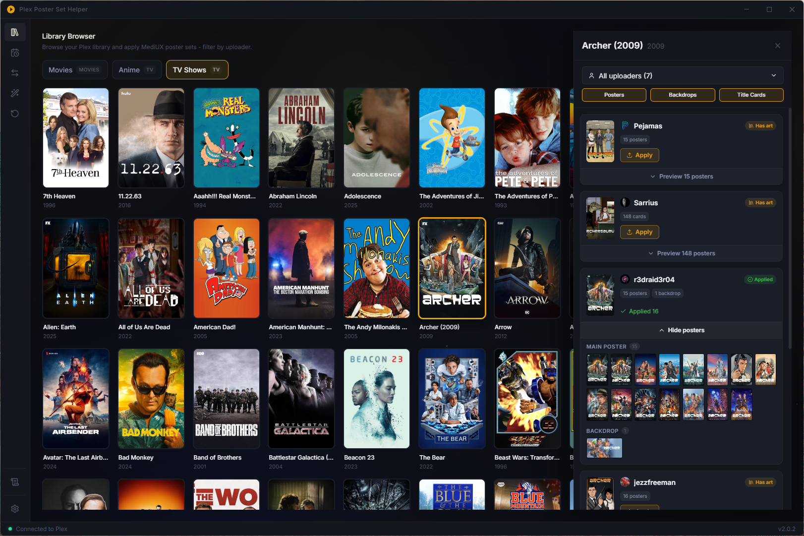
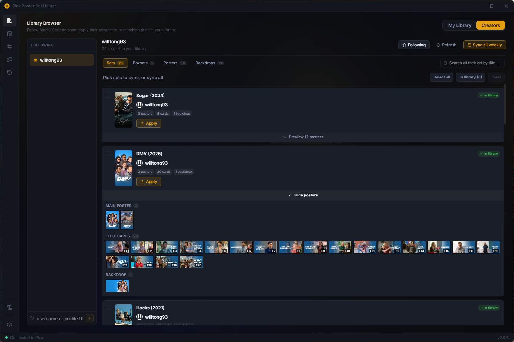
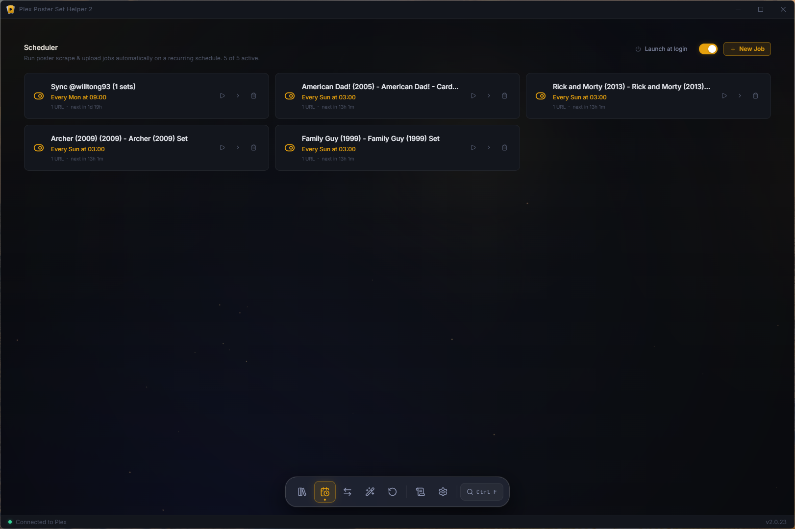
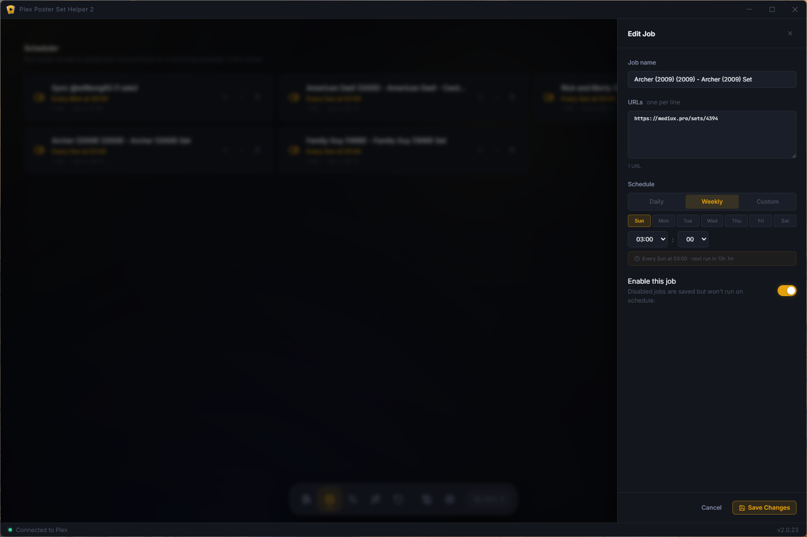
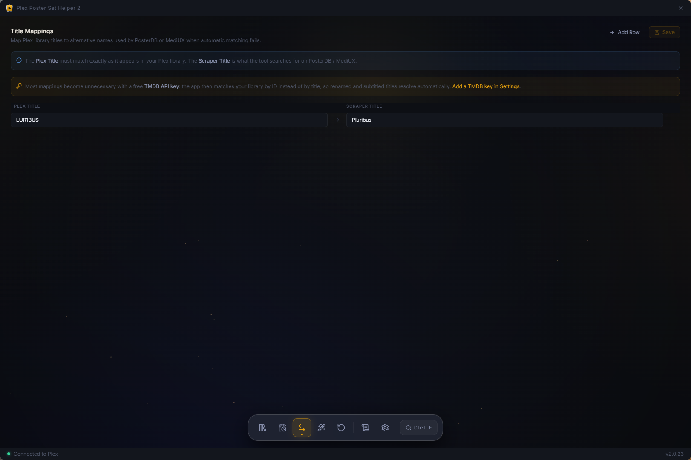
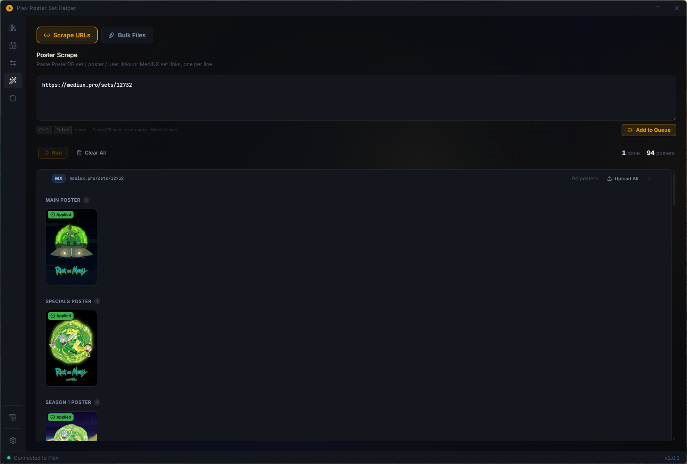
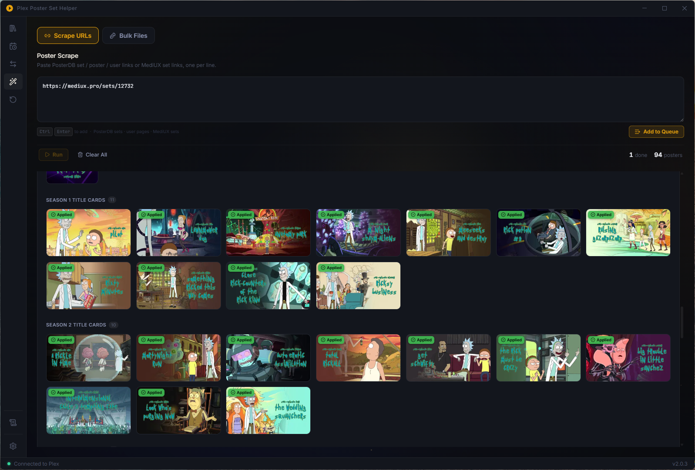
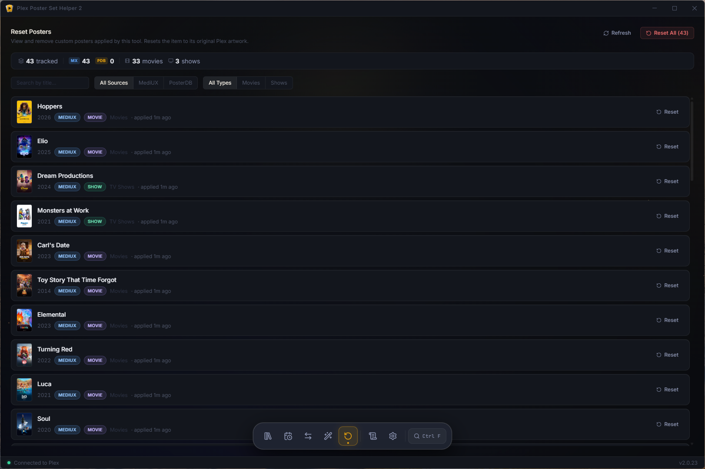
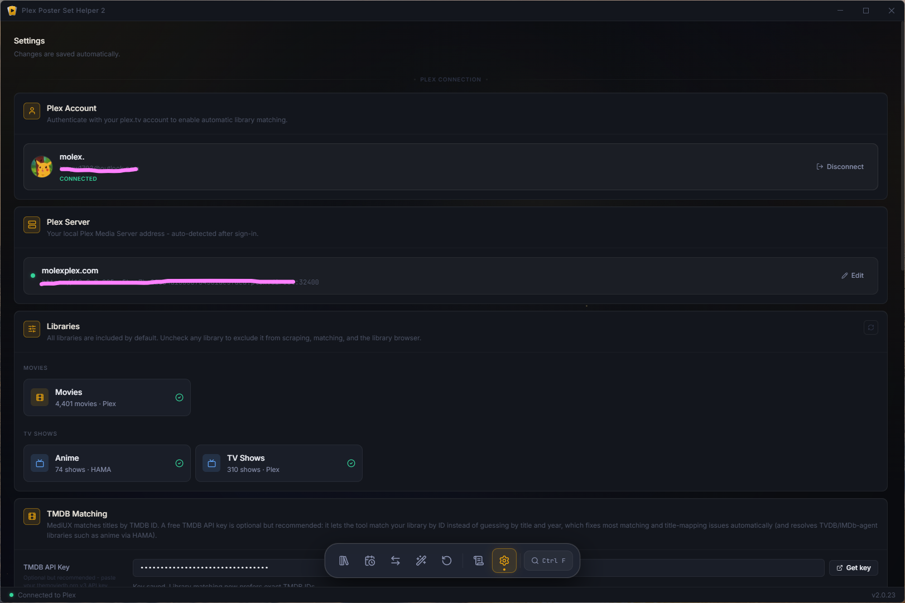
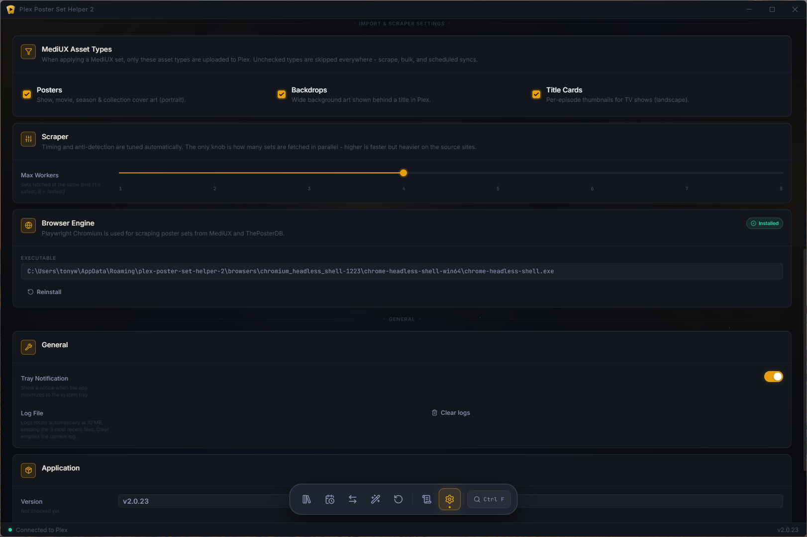

<p align="center">
  
</p>

<h1 align="center">Plex Poster Set Helper 2</h1>

<p align="center">
  Browse, download, and apply custom poster sets from <b>MediUX</b> and <b>ThePosterDB</b> to your Plex library - in a clean desktop app.
</p>

<p align="center">
  <a href="https://github.com/tonywied17/plex-poster-set-helper"></a>&nbsp;
  <a href="docker/README.md"></a>&nbsp;
  <a href="https://github.com/tonywied17/plex-poster-set-helper/actions/workflows/ci.yml"></a>&nbsp;
  <a href="LICENSE"></a>&nbsp;
  
</p>

<p align="center">
  <a href="https://github.com/tonywied17/plex-poster-set-helper/releases/latest"></a>&nbsp;
  <a href="https://github.com/tonywied17/plex-poster-set-helper/releases"></a>&nbsp;
  <a href="https://github.com/tonywied17/plex-poster-set-helper/releases/latest"></a>
</p>

---

## What it does

Plex Poster Set Helper 2 finds high‑quality poster artwork for the movies and shows already in your Plex library and applies it with a click - posters, season posters, episode title cards, and backdrops, all routed to the right place automatically.

<p align="center">
  
  
  
  
  
  
</p>

> Runs as a desktop app on **Windows** and **Linux**, or in **Docker** (including unraid) for always‑on servers.

---

## Application Preview

<div align="center">



<table>
  <tr>
    <td align="center"><a href=".github/assets/gallery/thumbs/1-creators-browser.png"><br/><sub>Creators Browser</sub></a></td>
    <td align="center"><a href=".github/assets/gallery/thumbs/2-scheduler-list.png"><br/><sub>Scheduler List</sub></a></td>
    <td align="center"><a href=".github/assets/gallery/thumbs/3-scheduler-edit.png"><br/><sub>Scheduler Editor</sub></a></td>
    <td align="center"><a href=".github/assets/gallery/thumbs/4-title-mappings.png"><br/><sub>Title Mappings</sub></a></td>
    <td align="center"><a href=".github/assets/gallery/thumbs/5-manual-scrape-top.png"><br/><sub>Manual Scrape</sub></a></td>
  </tr>
  <tr>
    <td align="center"><a href=".github/assets/gallery/thumbs/6-manual-scrape-titles.png"><br/><sub>Manual Scrape Titles</sub></a></td>
    <td align="center"><a href=".github/assets/gallery/thumbs/7-reset-posters.png"><br/><sub>Reset Posters</sub></a></td>
    <td align="center"><a href=".github/assets/gallery/thumbs/8-settings-top.png"><br/><sub>Settings Top</sub></a></td>
    <td align="center"><a href=".github/assets/gallery/thumbs/9-settings-bottom.png"><br/><sub>Settings Bottom</sub></a></td>
  </tr>
</table>

</div>

---

## Which version do I want?

Not sure where to run it? Here's the plain‑English version:

| You want to… | Use this |
|---|---|
| Use it on your own PC | **Desktop app** (Windows / Linux) - _start here_ |
| Run it on a home server / unraid in your browser | **Docker GUI** (the full app, in a web page) |
| Keep weekly schedules running 24/7 with no window open | **Docker headless** (just the background scheduler) |

The **Docker GUI** and **Docker headless** images are two different things: the GUI is the whole app you click around in; the headless one has **no interface at all** - it only runs the schedules you already set up. Most people just want the **desktop app**.

---

## Getting started

### Option 1 - Download the app (easiest)

1. Go to the **[Releases page](https://github.com/tonywied17/plex-poster-set-helper/releases/latest)**.
2. Download the installer for your system:
   - **Windows** → the `.exe` installer
   - **Linux** → the `.AppImage` or `.deb`
3. Install and launch it.
4. On first run, open **Settings → Sign in with Plex**, click the link, approve in your browser - done. Your libraries appear automatically.

> The app checks GitHub for new versions and can update itself with one click.

### Option 2 - Run from source

You'll need **[Node.js 22+](https://nodejs.org/)** installed.

```bash
git clone https://github.com/tonywied17/plex-poster-set-helper.git
cd plex-poster-set-helper
npm install
npm run dev
```

### Option 3 - Docker (servers / unraid / always‑on)

Run the full app in your browser, or a lightweight headless scheduler that keeps your weekly syncs going 24/7.

👉 **[Read the Docker guide →](docker/README.md)**

---

## First‑run setup

1. **Sign in to Plex** - Settings → *Sign in with Plex* → click the link → approve. (No token copy‑paste needed.)
2. **Confirm your libraries** - they're detected automatically after sign‑in.
3. *(Optional)* **Anime / non‑TMDB libraries** - if your library uses an agent without TMDB IDs (e.g. HAMA), add a free **TMDB API key** in Settings so titles can be matched.

That's it - head to the **Library Browser** and start applying posters.

---

## Scheduling - keep posters up to date automatically

The **Scheduler** lets you re‑apply a set on a repeating schedule, which is great for shows that keep getting new episodes (so new title cards get art too).

- **In the desktop app (Windows / Linux):** schedules run whenever the app is open **and** while it's **minimized to the system tray** - close the window and it keeps running quietly in the background. You can also enable **launch on startup** so it's always there after a reboot. No server required.
- **For 24/7 on a server:** set your schedules up once in the GUI, then run the **Docker headless** image to keep them firing around the clock without leaving anything open. See the [Docker guide](docker/README.md).

---

## How it works

| Source | What you can use |
|---|---|
| **[MediUX](https://mediux.pro)** | Set links (`/sets/123`), **boxsets** (`/boxsets/123` - a whole collection at once), and creator pages (`/user/name`). Full‑quality artwork, including season posters, title cards, and backdrops. |
| **[ThePosterDB](https://theposterdb.com)** | Set links (`/set/123`), single posters (`/poster/123`), and user uploads (`/user/name`). |

Posters are matched to your library by **TMDB ID** (read from each Plex item), so the right art lands on the right title. Everything you apply is tracked locally, so the **Reset** page always knows what's current, what was applied before, and where it came from.

---

## Building & development

```bash
npm run dev          # run the app in development (hot reload)
npm run build        # build renderer + main process
npm run dist         # package installers for the current OS (electron-builder)
npm run dist:win     # Windows installer
npm run dist:linux   # Linux AppImage + deb
npm run typecheck    # type-check renderer + main process
npm run lint         # eslint
```

**Stack:** Electron · React 18 · TypeScript · Vite · Playwright (scraping) · electron‑store.

---

## Contributing

Issues and pull requests are welcome. Please run `npm run lint` and `npm run typecheck` before opening a PR - CI runs both.

## License

[MIT](LICENSE) © tonywied17

## Credits

- **[MediUX](https://mediux.pro)** and **[ThePosterDB](https://theposterdb.com)** - the communities behind the artwork.
- Originally inspired by [**bbrown430/plex-poster-set-helper**](https://github.com/bbrown430/plex-poster-set-helper) (the Python original); rebuilt from the ground up as a cross‑platform desktop app.
